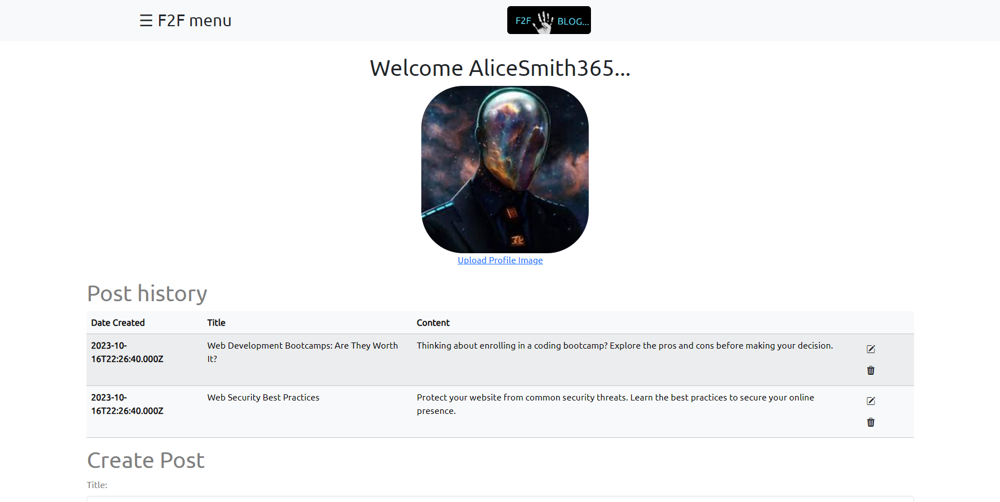

# F2F Blog
  
## Description

  What is the purpose of F2F Blog app?

### Educate
Our blog offers educational content, tutorials, and resources that cater to coders of all levels. Whether you're just starting or seeking to master a specific programming language, we've got you covered.

### Inspire
We share blog posts, success stories, and industry insights to spark your coding passion and fuel your personal and professional growth.

### Support
We're here to help, whether you're troubleshooting or exploring advanced coding techniques.

### Mission Statement
At F2F Blog, we're on a mission to enhance your coding and learning journey. Our focus is to provide valuable insights, resources, and expertise in programming, making knowledge accessible to everyone.

Join Us on Your Learning Journey!

  ## Table of Contents 
  
  - [Installation](#installation)
  - [Usage](#usage)
  - [Credits](#credits) 
  - [Contribution](#contribution)
  - [License](#license)
  - [Questions](#questions)
  
  ## Installation
  No installation necessary! [The app is hosted on heroku](https://f2f-blog-ad8f414d0b59.herokuapp.com/)
  
  If you would like to install to your local machine:
  * Clone the repository to your local machine and navigate to the folder in your node terminal
  * Run 'npm install' from the terminal to import the necessary node modules
  * If you have mysql installed on your machine, copy the contents of the schema.sql into your mysql shell and run them.
  * Run 'npm run seed' to install the necessary seed data.
  * Enter 'npm start' inside the terminal to begin the application
  * Navigate to 'localhost:3001' inside your browser to view the app

  ## Usage
  [Click this link to go to the deployed site](https://f2f-blog-ad8f414d0b59.herokuapp.com/)

  * The main blog page and resources page are open to anyone and everyone, browse the posts on the blog page or browse and search for community-provided resources for many different programming languages on the resources page
  * In order to make comments or post new blogs, register as a new user by going to the login page.
  * Enter your credentials to login, or register as a new user by clicking the register button below the login button.
  * Once logged in you will be taken to your main hub, the POST page, where you can edit, delete or create new blog posts, upload a profile picture, and view all of the posts you have created so far.
  * Navigate to the blog page, and you can view all posts, as well as leave comments on other blogs and upload a hero image to your own posts.
  * Navigate to the resources page and find helpful websites that aspiring developers can use to find more information on many of the technologies we have used thus far in the cohort,(as well as a secret link to stanleys cohort videos from the past couple of years, don't tell anyone if you find it, it's a secret ::wink,wink::)
  * At the bottom of the resources page, you can browse communitity-uploaded resources to various sites and sources of information, and if logged in, you can upload your own and help to build a resource library for your fellow coding community!
  * The about page includes our mission statement, as well as some solid coding mantras, and a slideshow of the site in action.
  * Visit the contact us page to learn a little bit about the developers behind F2F-Blog and click the github icons next to their photos to be taken to their respective github profiles.

  ## Demo

  

  ## Contribution

  Explore the site and become an active part in it! Share insights, knowledge, advice, show off your own projects, ask for advice on that project or homework assignment you're hung up on, and join a community of fellow aspiring developers, all are welcome!

  ## Credits

  * UCF Full-Time Full-Stack Coding Bootcamp
  * Beszcoder.com: Provided tutorials on how to integrate multer into the blog site to upload images to the database
  * Ali(TA) Came in at the end to save us a ton of time and headache trying to figure out how to revert back to a previous version of the site, he saved the day!

  ## License

  [MIT](https://opensource.org/licenses/MIT)

  ## Questions
  
  Reach out to us if you have any questions about the project!
  
###
  * F2F Blog (Fist to Five Blog)
    * Abigail Burtley | Slack name: Abigail | Github : Ariesscode
    * Joseph Onate | Slack name: joseph onate | GitHub: Josephonate
    * Nathaniel Price | Slack name: Nathaniel Price | Github : newprice247
    * Yesenia Benitez | Slack name: Yesenia Benitez | Github: yeseniax2
    * Katie Waters | Slack name: Katie Waters | Github: kwaters3

Project Github Repo:  https://github.com/newprice247/F2F-Blog

Project Heroku Deployment:  https://f2f-blog-ad8f414d0b59.herokuapp.com/
